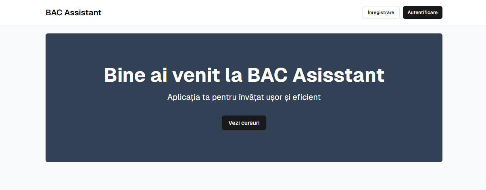

# BAC Assistant



Application for students and teachers to cram for baccalaureate exam using gamification techniques.

## Clone and run locally

1. Rename `.env.example` to `.env.local` and update the following:

   ```
   NEXT_PUBLIC_SUPABASE_URL=[INSERT SUPABASE PROJECT URL]
   NEXT_PUBLIC_SUPABASE_ANON_KEY=[INSERT SUPABASE PROJECT API ANON KEY]
   SUPABASE_SERVICE_KEY=[INSERT SUPABASE PROJECT SERVICE KEY]
   ```

   Both `NEXT_PUBLIC_SUPABASE_URL` and `NEXT_PUBLIC_SUPABASE_ANON_KEY` can be found in [your Supabase project's API settings](https://app.supabase.com/project/_/settings/api)

2. You can now run the Next.js local development server:

   ```bash
   npm run dev
   ```

   The starter kit should now be running on [localhost:3000](http://localhost:3000/).


## Tool scripts
### Create admin users
```bash
npm run create-admin -- <email> <password> <fistName> <lastName>
```

### Sync Supabase auth user metadata with database
```bash
npm run sync-user-meta
```